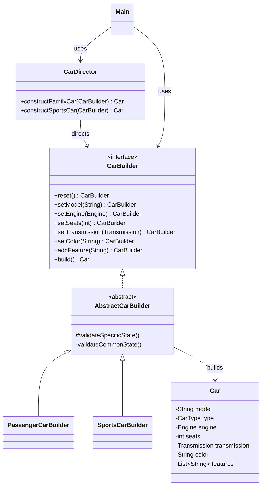

# Car Builder Pattern

This Java 17 project demonstrates the Builder creational design pattern by constructing two meaningfully different `Car` representations: a practical passenger car and a high-performance sports car. It includes a reusable Director, a fluent API, validation, an immutable Product, a runnable Client, and dependency-free tests.

## What the Builder pattern solves

A `Car` has several parts: model, engine, seat count, transmission, color, and optional features. Passing all of these values to one large constructor is difficult to read and makes invalid combinations easier to create. The Builder pattern moves the step-by-step construction process into dedicated builder objects.

The client can therefore write readable code such as:

```java
Car car = new PassengerCarBuilder()
        .setModel("AITU Eco Custom")
        .setEngine(new Engine("Electric Drive", 220, FuelType.ELECTRIC))
        .setSeats(5)
        .setTransmission(Transmission.AUTOMATIC)
        .setColor("Pearl White")
        .addFeature("Fast charging")
        .build();
```

Each configuration method returns the same builder, allowing the calls to be chained. The final `build()` call validates the accumulated state and creates an immutable `Car`.

## Pattern participants

| Participant | Project class | Responsibility |
| --- | --- | --- |
| Product | `Car` | Stores the finished, immutable car configuration. |
| Builder | `CarBuilder` | Declares the construction steps available to clients and the Director. |
| Shared builder logic | `AbstractCarBuilder` | Implements fluent setters, common validation, construction, and reset behavior. |
| Concrete Builder 1 | `PassengerCarBuilder` | Produces passenger cars and requires four to seven seats. |
| Concrete Builder 2 | `SportsCarBuilder` | Produces sports cars with at most two seats, at least 300 hp, and a performance transmission. |
| Director | `CarDirector` | Runs reusable construction sequences for family and sports configurations. |
| Client | `Main` | Demonstrates Director-based and direct fluent construction. |

## UML class diagram



The editable PlantUML version is available at [`docs/uml/car-builder.puml`](docs/uml/car-builder.puml).

## Requirements

- JDK 17 or newer
- Bash for the included helper scripts
- No external Java dependencies

Confirm Java is installed:

```bash
java -version
javac -version
```

Both commands should report version 17 or newer.

## Compile and run

From the repository root:

```bash
./scripts/run.sh
```

The script compiles the main source files and runs `kz.aitu.builder.app.Main`. The program prints a family car, a sports car, and a custom electric passenger car.

To compile without running:

```bash
./scripts/compile.sh
```

## Run the tests

```bash
./scripts/test.sh
```

The tests verify both valid representations, validation failures, product immutability, and automatic builder reset. A successful run ends with:

```text
All 7 tests passed.
```

## Run in IntelliJ IDEA

1. Open IntelliJ IDEA.
2. Choose **Open** and select the repository folder.
3. Set the Project SDK to JDK 17 if IntelliJ asks.
4. Open `src/main/java/kz/aitu/builder/app/Main.java`.
5. Click the green Run icon beside `main()`.
6. To run the tests, open `CarBuilderTest.java` and run its `main()` method.

The included `pom.xml` also describes the project as Java 17, so IntelliJ may import it as a Maven project. Maven is optional because the provided scripts use `javac` directly.

## Project structure

```text
car-builder-pattern/
├── docs/
│   └── uml/
│       └── car-builder.puml
├── scripts/
│   ├── compile.sh
│   ├── run.sh
│   └── test.sh
├── src/
│   ├── main/java/kz/aitu/builder/
│   │   ├── app/Main.java
│   │   └── car/
│   │       ├── AbstractCarBuilder.java
│   │       ├── Car.java
│   │       ├── CarBuilder.java
│   │       ├── CarDirector.java
│   │       ├── PassengerCarBuilder.java
│   │       ├── SportsCarBuilder.java
│   │       └── supporting types
│   └── test/java/kz/aitu/builder/car/CarBuilderTest.java
├── .gitignore
├── pom.xml
└── README.md
```

## Validation rules

All cars require a nonblank model and color, an engine, at least one seat, and a transmission. The concrete builders add rules for their representations:

- Passenger cars require between four and seven seats.
- Sports cars allow at most two seats.
- Sports cars require at least 300 horsepower.
- Sports cars require `MANUAL` or `DUAL_CLUTCH` transmission.

`build()` throws an `IllegalStateException` with a clear message when a rule is broken. Invalid objects are never returned.

## Design decisions

- `Car` is immutable so a completed product cannot change unexpectedly.
- `CarBuilder` lets the Director work with an abstraction instead of a concrete class.
- `AbstractCarBuilder` keeps shared setters and validation in one place.
- Concrete builders contain only rules unique to their representations.
- `CarDirector` stores reusable recipes but remains optional; clients may use a builder directly.
- Named constants replace unexplained numeric values in validation and predefined recipes.

## Assignment report

The Word report is stored in `docs/report/Builder_Pattern_Car_Report.docx`. Before submission, replace the marked student-name and group placeholders and confirm the exact Moodle deadline.

